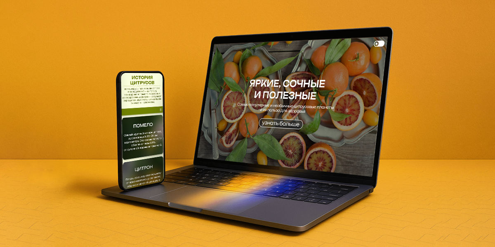

# Цитрусы — Интерактивный одностраничный сайт

## Описание проекта:
Цитрусы — это адаптивный лэндинг, рассказывающий о самых популярных и необычных цитрусовых нашей планеты, их истории и пользе для здоровья.

Этот небольшой проект был создан в качестве тренировки навыков вэб-дизайнера и фронтенд-разработчика. Он является моим первым самостоятельным проектом, выполненным с полной творческой свободой — от идеи и макета до интерактивного программирования.

**Ссылка на проект:** https://sawylynx.github.io/citruses/

**Ссылка на дизайн-кейс на Behance:**

**Технологический стек:** 
*   **HTML5** - семантическая структура, разметка тематических блоков и обеспечение доступности.
*   **CSS3** -  верстка внешнего вида сайта, адаптированного под все типы устройств.
*   **JavaScript (ES6+)** - реализация кастомной кнопки переключения светлой и темной темы сайта, а также мобильного бургер-меню.

## Реализованный функционал
1. **Динамическая смена темы:**
   * Реализована при помощи JavaScript и CSS-переменных. Способна автоматически определять системные настройки пользователя, при помощи `prefers-color-scheme`, и подстраиваться под них.
   * Сохраняет выбранную тему в `localStorage`, благодаря чему выбор пользователя не сбрасывается при перезагрузке страницы или повторном посещении сайта.
2. **Адаптивность сайта под все расширения:**
   * Реализована при помощи медиазапросов, заданных функцией `clamp()` диапазонов размеров.
   *  Для экранов шириной менее `1700px` активируется интерактивное бургер-меню. Меню автоматически скрывается при клике на любую навигационную ссылку или в любую пустую область экрана.
3. **Кастомное меню навигации в виде ярких карточек:**
   * Реализовано при помощи div блоков вложенных в элементы списка.
   *  В оформлении использованы фоновые изображения для карточек, повернутый текст пунктов меню и различные эффекты наложения для четкого выделения текста на ярком фоне.
4. **Кастомные графические эффекты:**
   * При оформлении лэндинга было применено сочетание режима наложения `mix-blend-mode: multiply`, градиентных масок `mask-image, linear-gradient` и размытие фона `backdrop-filter: blur`

**Использованные программы:** 
*   **Figma** - проектирование UI/UX, создание композиции, адаптивных макетов и прототипа будущего лэндинга
*   **Adobe Photoshop** - цветокоррекция и подготовка растровых изображений
*   **Adobe Illustrator** - создание векторной графики, фавикона и кастомных SVG-иконок/кнопок
*   **Visual Studio Code** - написание кода
*   **Google Chrome** - тестирование адаптивности, отладка JavaScript-логики и проверка доступности через DevTools

## Структура проекта
```
├── index.html          # Главная страница сайта 
├── css/
│   ├── style.css       # Основные стили лэндинга, медиазапросы и адаптив
│   ├── variables.css   # Все переменные проекта: цвета, градиенты, тени, шрифты и их размеры
│   ├── dark.css        # Переменные и переопределения для тёмной темы
│   └── global.css      # Общие стили лэндинга и сброс базовых настроек браузера 
├── js/
│   └── script.js       # Логика бургер-меню и переключения тем
├── fonts/              # Папка со всеми шрифтами проекта
│   ├── fonts.css       # Подключение локальных шрифтов к лэндингу
└── images/             # Папка с графикой (изображения, иконки, фавиконы)
```

## Запуск проекта:
Вы можете запустить и изучить проект локально на своем компьютере:
1. Склонируйте репозиторий при помощи git bash  или терминала:
   ```bash
    git clone git@github.com:SawyLynx/citruses.git
    ```
2. Перейдите в папку с проектом.
3. Откройте файл `index.html` в любом современном браузере****
